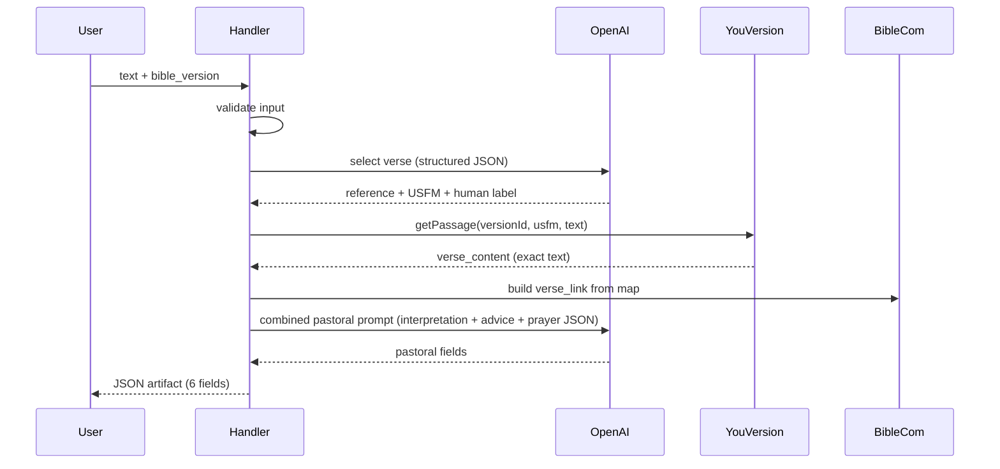

# Prayer Request Blocks.ai Agent

## Current state

The repo already has a Blocks scaffold at [`prayer_request/`](prayer_request/):

- [`agent-card.json`](prayer_request/agent-card.json) — identity is correct (`agentName`: `prayer_request`, `displayName`: "Prayer Request") but IO is still the default single `text` input and plain `text/plain` output.
- [`handler.ts`](prayer_request/handler.ts) — echo stub only.
- [`trigger.ts`](prayer_request/trigger.ts) — sends a hello-world string.
- [`package.json`](prayer_request/package.json) — lists `@blocks-network/sdk` + `dotenv` only (see **Dependencies** below).
- [`.env`](prayer_request/.env) — `BLOCKS_API_KEY` and **`YOUVERSION_APP_KEY` already set** (ready for YouVersion SDK).

**Dependencies review (as of plan update):**

| Package | `package.json` | `node_modules` | Action at implement |
|---------|----------------|----------------|---------------------|
| `@youversion/platform-core` | Not listed yet | Not present under `prayer_request/` | Pin in `package.json` + `npm install` in `prayer_request/` (you may have installed elsewhere; implementation will ensure it is recorded and installed for the agent runtime/Dockerfile) |
| `openai` | Not listed | — | Add + install |
| `@blocks-network/sdk`, `dotenv` | Present | — | Keep |

Implementation follows [config.blocks.ai/SKILL.md](https://config.blocks.ai/SKILL.md) Steps 5–10 (handler + IO, then you run `blocks publish`, `blocks check`, `blocks run`, `npx tsx trigger.ts`, `blocks dashboard`).

## Architecture



**Design principles**

- **Never invent scripture**: OpenAI only picks reference/USFM; `verse_content` always comes from YouVersion `getPassage(..., "text")` with headings/notes off.
- **User-provided prompts** for pastoral outputs: load from [`prompts/`](prompts/) at runtime (not hardcoded in TypeScript).
- **Two OpenAI calls** (token-optimized): (1) verse selection (small JSON), (2) **single combined pastoral call** that returns `verse_interpretation`, `advice`, and `prayer` in one `json_schema` response — your three `.md` files are still the source of truth, composed into one request (see §4).
- **Crisis/safety language** stays in your prompt files; no duplicate guardrails in TypeScript.

## Files to add or change

| File | Purpose |
|------|---------|
| [`prayer_request/agent-card.json`](prayer_request/agent-card.json) | Full input/output JSON schemas, `maxRunningTimeSec`, skill examples |
| [`prayer_request/handler.ts`](prayer_request/handler.ts) | Orchestration, validation, artifact return |
| [`prayer_request/lib/parseRequest.ts`](prayer_request/lib/parseRequest.ts) | Parse `task.requestParts[0]` JSON (pattern from [`blocks-dice/dice/handler.ts`](../../blocks-dice/dice/handler.ts)) |
| [`prayer_request/lib/bibleVersions.ts`](prayer_request/lib/bibleVersions.ts) | Allowed abbreviations enum, default `ESV`, YouVersion ID resolution |
| [`prayer_request/lib/youversionBible.ts`](prayer_request/lib/youversionBible.ts) | `@youversion/platform-core` client, `getPassage`, version lookup |
| [`prayer_request/lib/bibleComLink.ts`](prayer_request/lib/bibleComLink.ts) | bible.com reader URL builder + fallbacks |
| [`prayer_request/lib/promptLoader.ts`](prayer_request/lib/promptLoader.ts) | Read `prompts/*.md`, substitute `{{placeholders}}`, return system/user messages |
| [`prayer_request/lib/openaiPrayer.ts`](prayer_request/lib/openaiPrayer.ts) | Orchestrate 4 OpenAI calls using loaded prompts |
| [`prayer_request/lib/bookUsfm.ts`](prayer_request/lib/bookUsfm.ts) | Map book names → USFM (e.g. Philippians → `PHP`) for OpenAI output normalization |
| [`prompts/`](prompts/) (repo root) | **Source of truth** for pastoral prompts (user-authored) |
| [`prompts/prompt_verse_selection.md`](prompts/prompt_verse_selection.md) | Verse picker (user-provided content; add `usfm` to JSON output — see §4) |
| [`prayer_request/trigger.ts`](prayer_request/trigger.ts) | Run all 7 test scenarios (CLI arg or default suite) |
| [`prayer_request/package.json`](prayer_request/package.json) | Pin `@youversion/platform-core` (verify install), add `openai` |
| [`prayer_request/.env.example`](prayer_request/.env.example) | Document `BLOCKS_API_KEY`, `YOUVERSION_APP_KEY`, `OPENAI_API_KEY` (placeholders only) |

## 1. Update `agent-card.json` IO

### Bible version: top 10 only (YouVersion-backed)

Restrict `bible_version` to **10 English translations** that YouVersion Platform provides and that the app commonly highlights. Default: **ESV**.

**Allowlist** (single source of truth in `bibleVersions.ts`, mirrored in `agent-card.json` enum):

| Abbrev | Name |
|--------|------|
| ESV | English Standard Version (default) |
| NIV | New International Version |
| KJV | King James Version |
| NKJV | New King James Version |
| NLT | New Living Translation |
| NASB | New American Standard Bible |
| CSB | Christian Standard Bible |
| NRSV | New Revised Standard Version |
| MSG | The Message |
| AMP | Amplified Bible |

At implementation time, call **`bibleClient.getVersions("en*")`** once ([Core SDK](https://developers.youversion.com/sdks/javascript/index)) and **bind each allowlist abbrev** to a `BibleVersion.id` (match on `abbreviation` / `localized_abbreviation`). If any of the 10 fail to resolve, log a warning and document the substitute; do not expose extra versions in the UI.

**Input** (`id: request`, `application/json`):

```json
{
  "text": { "type": "string", "title": "User concern, problem, prayer, or topic" },
  "bible_version": {
    "type": "string",
    "title": "Bible version",
    "enum": ["ESV", "NIV", "KJV", "NKJV", "NLT", "NASB", "CSB", "NRSV", "MSG", "AMP"],
    "default": "ESV"
  }
}
```

- `required`: `["text"]` only; `bible_version` optional — when omitted, handler uses **ESV**.
- Invalid `bible_version` (not in enum): normalize to **ESV** with optional status note (do not fail the task).
- `example`: `{ "text": "I feel anxious about the future", "bible_version": "ESV" }`.

**Output** (`id: result`, `application/json`, `guaranteed: true`):

Properties: `bible_verse`, `verse_link`, `verse_content`, `verse_interpretation`, `advice`, `prayer` (all strings). Include `example` object matching spec (e.g. Philippians 4:6-7).

**Runtime**: set `maxRunningTimeSec: 180` (LLM + Bible API). Keep `taskKinds: ["request", "pipe"]`.

**Skills**: add `examples` array with sample concerns (anxiety, grief, gratitude) for dashboard “Try it”.

## 2. YouVersion Platform SDK integration

**Docs (canonical):**

- [JavaScript SDK — Core](https://developers.youversion.com/sdks/javascript/index) — `ApiClient`, `BibleClient`, method signatures
- [TypeScript types](https://developers.youversion.com/sdks/typescript-types) — `BibleVersion`, `BiblePassage`, `BookUsfm`
- [Quick start](https://developers.youversion.com/sdks/javascript/quick-start) — minimal `getPassage` example

**Package:** `@youversion/platform-core` (already intended; ensure pinned in `package.json` and installed under `prayer_request/`).

**Client setup** (`youversionBible.ts`):

```ts
import 'dotenv/config';
import { ApiClient, BibleClient } from '@youversion/platform-core';

const apiClient = new ApiClient({ appKey: process.env.YOUVERSION_APP_KEY! });
const bibleClient = new BibleClient(apiClient);
```

`YOUVERSION_APP_KEY` is **already in** [`prayer_request/.env`](prayer_request/.env) — no new key needed from you for YouVersion.

### Version resolution (`bibleVersions.ts`)

- Export `ALLOWED_BIBLE_VERSIONS` (10 abbreviations) and `DEFAULT_BIBLE_VERSION = "ESV"`.
- **Resolve IDs** via SDK (not hand-rolled REST):

```ts
const { data } = await bibleClient.getVersions('en*');
// Map allowlist abbrev → BibleVersion (id, abbreviation, youversion_deep_link, copyright, title)
```

- Use typed [`BibleVersion`](https://developers.youversion.com/sdks/typescript-types): `id: number`, `abbreviation`, `localized_abbreviation`, `youversion_deep_link`, `copyright`, `books: BookUsfm[]`.
- Match user `bible_version` (case-insensitive) against allowlist; unknown → **ESV**.
- Optional: `bibleClient.getVersion(id)` to confirm a resolved version before first `getPassage` (helps debug 404s per SDK troubleshooting notes).

### Passage fetch (`getPassage` — recommended API for verse text)

Per [Passage Methods](https://developers.youversion.com/sdks/javascript/index):

```ts
const passage = await bibleClient.getPassage(
  versionId,
  usfm,           // e.g. "PHP.4.6-7" (BOOK.CHAPTER.VERSE or range)
  'text',         // plain text, not HTML
  false,          // include_headings: false
  false,          // include_notes: false
);
```

Typed [`BiblePassage`](https://developers.youversion.com/sdks/typescript-types):

| Field | Use in agent |
|-------|----------------|
| `id` | USFM passage id (sanity check vs OpenAI `usfm`) |
| `content` | **`verse_content`** — exact text, no paraphrase |
| `reference` | Fallback for **`bible_verse`** label if OpenAI reference needs normalization |

- OpenAI still supplies canonical display reference (e.g. `Philippians 4:6-7`); prefer that for `bible_verse` when well-formed, else `passage.reference`.
- **USFM book codes**: use standard 3-letter codes (`PHP`, `PSA`, `JHN`, …); see [USFM reference](https://developers.youversion.com/usfm-reference) linked from SDK docs. `bookUsfm.ts` maps full book names from OpenAI → `BookUsfm`.
- **Copyright**: SDK/docs require attribution when displaying Bible text ([Quick start](https://developers.youversion.com/sdks/javascript/quick-start)). Surface `BibleVersion.copyright` via `reportStatus` only (not inside `verse_content`).
- **Passage fetch failure** for a valid allowlist version: retry once with **ESV** `versionId`, then error artifact.

## 3. bible.com `verse_link` builder

Target format when supported:

`https://www.bible.com/bible/{pathId}/{BOOK}.{chapter}.{verses}.{SUFFIX}`

Example: `https://www.bible.com/bible/59/PHP.4.6-7.ESV`

**Important**: `BibleVersion.id` (YouVersion API) often matches the numeric segment in `youversion_deep_link` (e.g. `https://www.bible.com/versions/3034`), but bible.com **reader** passage URLs may use a **different** path id (ESV reader uses `59`, not necessarily the API id). Plan:

- Curated map in [`bibleComLink.ts`](prayer_request/lib/bibleComLink.ts) for the **same 10 abbreviations** → `{ readerPathId, suffix }`, verified during implementation.
- **Fallback chain** for `verse_link`:
  1. Curated reader URL: `https://www.bible.com/bible/{readerPathId}/{USFM}.{SUFFIX}`
  2. `BibleVersion.youversion_deep_link` (version page — valid URL per SDK type)
  3. `https://www.bible.com/` only as last resort

Document in code which versions use fallback so behavior is predictable.

## 4. OpenAI modules and user prompts

**Dependencies**: `openai` (same pattern as yoda agent).

**Env**: `OPENAI_API_KEY`; optional `OPENAI_MODEL` (default `gpt-4o-mini`).

### Prompt files (provided by you)

| File | Output field | Template variables |
|------|----------------|-------------------|
| [`prompts/prompt_verse_selection.md`](prompts/prompt_verse_selection.md) | (internal → `bible_verse` + `usfm`) | `{{text}}`, `{{bible_version}}` |
| [`prompts/prompt_verse_interpretation.md`](prompts/prompt_verse_interpretation.md) | `verse_interpretation` | `{{text}}`, `{{bible_version}}`, `{{bible_verse}}`, `{{verse_content}}` |
| [`prompts/prompt_advice.md`](prompts/prompt_advice.md) | `advice` | `{{text}}`, `{{bible_verse}}`, `{{verse_content}}`, `{{verse_interpretation}}` |
| [`prompts/prompt_prayer.md`](prompts/prompt_prayer.md) | `prayer` | `{{text}}`, `{{bible_verse}}`, `{{verse_interpretation}}`, `{{advice}}` |

**Verse selection prompt (your text)** — save verbatim to `prompts/prompt_verse_selection.md`, with one **implementation addition** to the OUTPUT JSON block for YouVersion `getPassage`:

```json
{
  "bible_verse": "Book Chapter:Verse-Verse",
  "usfm": "PHP.4.6-7"
}
```

- `usfm` = 3-letter USFM book + chapter + verse(s) — required for YouVersion; validated via `bookUsfm.ts`.
- **Omit `reasoning` from the JSON schema** sent to OpenAI (saves output tokens). Your markdown file may still mention it; implementation enforces schema without `reasoning`. Add `OPENAI_INCLUDE_REASONING=true` only for debug if needed.

- **Output shape** (pastoral): per your three prompt files — interpretation 2–4 paragraphs; advice 3–5 bullets; prayer ~50–100 words ending with “In Jesus name, Amen.”
- **KJV tone**: `prompt_prayer.md` notes KJV tone when applicable; include `bible_version` in combined pastoral user payload.

### `promptLoader.ts`

- Resolve path to repo [`prompts/`](prompts/) from handler cwd: prefer `../prompts/` when running from `prayer_request/`, with env override `PROMPTS_DIR` for Docker.
- `loadPrompt(name, vars)` → replace `{{key}}` with string values; throw if required var missing.
- Cache file contents in memory after first read.

### Call 1 — Verse selection (structured JSON, minimal tokens)

Uses [`prompts/prompt_verse_selection.md`](prompts/prompt_verse_selection.md).

| Knob | Value |
|------|--------|
| Model | `gpt-4o-mini` (env `OPENAI_MODEL`) |
| `max_tokens` | ~120 |
| `temperature` | 0.3 (deterministic reference) |
| Input cap | `text` truncated to `OPENAI_MAX_USER_TEXT_CHARS` (default **1500**) before substitute |

- **Output schema**: `{ bible_verse, usfm }` only.
- **User message**: compact block only — `Concern: …\nVersion: …` — after substituting into the cached system prompt (avoid duplicating long INPUTS in both system and user).

### Call 2 — Combined pastoral (one request, three outputs)

**Why one call:** Avoids sending `verse_content` + `text` + static guardrails **three times** (~40–60% fewer input tokens vs 3 sequential calls). Quality preserved: model sees full verse once and produces all three fields in order.

**Composition** (`buildPastoralMessages` in `openaiPrayer.ts`):

1. **System**: short wrapper (~200 tokens) + instructions to follow three tasks and return JSON only.
2. **User**: single payload with substituted content from all three files (templates filled once):

```
--- Task 1: Interpretation ---
{filled prompt_verse_interpretation.md}

--- Task 2: Advice ---
{filled prompt_advice.md — see input dedup below}

--- Task 3: Prayer ---
{filled prompt_prayer.md — placeholders for interpretation/advice left as "See Task 1/2 outputs in your JSON"}
```

For the combined call, **advice** and **prayer** templates are loaded with placeholders `{{verse_interpretation}}` = `"(produce in Task 1)"` and `{{advice}}` = `"(produce in Task 2)"` so we do **not** need a prior interpretation call. The model generates all three fields in one JSON object.

| Knob | Value |
|------|--------|
| `max_tokens` | ~1100 (interpretation ~450 + advice ~350 + prayer ~150 + buffer) |
| `temperature` | 0.6 |
| `response_format` | `json_schema` with required `verse_interpretation`, `advice`, `prayer` strings |

**Escape hatch:** `OPENAI_PASTORAL_MODE=sequential` env runs the original 3-call path for A/B debugging only (not default).

Validate all six output strings are non-empty before returning; on OpenAI failure return JSON `{ error: "..." }` with `outputId: "result"`.

## 4b. Token optimization (summary)

| Technique | Estimated savings |
|-----------|-------------------|
| 4 calls → **2 calls** | Largest: ~2× less repeated system overhead + no triple `verse_content` |
| Drop `reasoning` from selection JSON | ~30–80 output tokens / request |
| Cap user `text` at 1500 chars | Bounds worst-case input |
| `max_tokens` per call | Prevents runaway completions |
| `gpt-4o-mini` default | Lowest cost model that fits pastoral tone |
| **Prompt file cache** in `promptLoader` | Avoid disk re-read; same bytes for OpenAI **prompt caching** eligibility on static system prefixes |
| **Advice input dedup** (recommended edit to [`prompts/prompt_advice.md`](prompts/prompt_advice.md)) | Remove `verse_content` from INPUTS — interpretation already carries meaning; saves ~50–300 tokens in combined call |
| Verse selection at `temperature` 0.3 | Fewer regen/retries |

**Not doing** (would hurt quality or spec):

- Skipping YouVersion fetch (required for exact `verse_content`)
- Summarizing `verse_content` with a model before pastoral call (adds tokens + paraphrase risk)
- Merging verse **selection** into pastoral call (would let model invent verse text)

**Optional later:** OpenAI [Prompt Caching](https://platform.openai.com/docs/guides/prompt-caching) if static system bodies exceed cache minimums — mark unchanging prompt file bytes with cache-friendly ordering (selection system, then pastoral system).

### Docker / deploy note

[`prayer_request/Dockerfile`](prayer_request/Dockerfile) currently `COPY . .` only inside `prayer_request/`. To include repo-root prompts at runtime, either:

- **Option A (recommended):** Copy `prompts/` into the image — build from repo root with `COPY prompts ./prompts` + `COPY prayer_request/ .`, or duplicate/sync `prayer_request/prompts/` from root at build time.
- **Option B:** Set `PROMPTS_DIR` in agent env to a mounted path.

Implementation will use **Option A** (copy `prompts/` next to handler in image) so Blocks `blocks run` / publish behave the same locally and in Docker.

## 5. Handler flow ([`handler.ts`](prayer_request/handler.ts))

1. `parseRequest` → `{ text, bible_version }` or `{ error }`.
2. If `text` missing/blank → `{ error: "text is required" }` (test case 7).
3. `reportStatus` milestones: "Selecting verse…", "Fetching Scripture…", "Preparing response…".
4. Resolve version → YouVersion `versionId`.
5. OpenAI verse selection (`prompt_verse_selection.md`) → normalize USFM via `bookUsfm.ts`.
6. `getPassage` → `verse_content`; on API error, retry ESV once, then return clear error artifact.
7. Build `verse_link`.
8. OpenAI: combined pastoral call → `verse_interpretation`, `advice`, `prayer`.
9. Return single `application/json` artifact:

```json
{
  "bible_verse": "Philippians 4:6-7",
  "verse_link": "https://www.bible.com/bible/59/PHP.4.6-7.ESV",
  "verse_content": "...",
  "verse_interpretation": "...",
  "advice": "...",
  "prayer": "..."
}
```

## 6. Test harness ([`trigger.ts`](prayer_request/trigger.ts))

Extend trigger to run scenarios (all or `npx tsx trigger.ts anxiety`):

| # | Scenario | Input |
|---|----------|-------|
| 1 | Anxiety/fear | `text` about worry/fear |
| 2 | Grief | loss / mourning |
| 3 | Decision-making | major life choice |
| 4 | Gratitude | thankfulness |
| 5 | Forgiveness | need to forgive |
| 6 | KJV | same concern + `bible_version: "KJV"` |
| 7 | Empty input | `text: ""` → expect `error` |

Assert: JSON parses; required keys present; case 7 has `error`; case 6 `verse_content` differs from ESV when API provides KJV.

Uses existing `BLOCKS_API_KEY` + `billingMode: 'free'` (or `listing: 'playground'` if needed for unpublished agent).

## Secrets / environment

| Secret | Status | Used for |
|--------|--------|----------|
| `BLOCKS_API_KEY` | In `.env` | `trigger.ts` / publish / run |
| `YOUVERSION_APP_KEY` | **In `.env`** | `ApiClient({ appKey })` → `BibleClient` |
| `OPENAI_API_KEY` | **Still needed** | Verse selection + interpretation/advice/prayer |

Optional env:

| Variable | Default | Purpose |
|----------|---------|---------|
| `OPENAI_MODEL` | `gpt-4o-mini` | All calls |
| `OPENAI_MAX_USER_TEXT_CHARS` | `1500` | Cap `text` input |
| `OPENAI_PASTORAL_MODE` | `combined` | `combined` \| `sequential` (debug) |
| `OPENAI_INCLUDE_REASONING` | `false` | Add `reasoning` to selection schema if true |

**Do not commit** `.env`; add `.env.example` with placeholder names only.

## Post-implementation (you run per SKILL)

```bash
cd prayer_request
npm install       # ensures @youversion/platform-core + openai in node_modules
blocks publish    # after blocks login if needed
blocks check
blocks run        # background
npx tsx trigger.ts
blocks dashboard
```

## Risk notes

- **Version coverage**: All 10 abbreviations should resolve on YouVersion; implementation verifies via `/v1/bibles` at startup. bible.com reader `pathId` may differ from YouVersion `id` for some versions — curated map + `youversion_deep_link` fallback still yields a valid URL.
- **Licensing**: YouVersion requires copyright display when showing Bible text; we keep exact text in `verse_content` only and can surface copyright in `reportStatus` if required by ToS review.
- **Latency**: Two OpenAI calls + one Bible fetch ≈ 8–25s; `maxRunningTimeSec: 180` is sufficient.
- **Tokens**: Combined pastoral call is the main cost center; monitor with OpenAI usage dashboard during trigger test suite.
